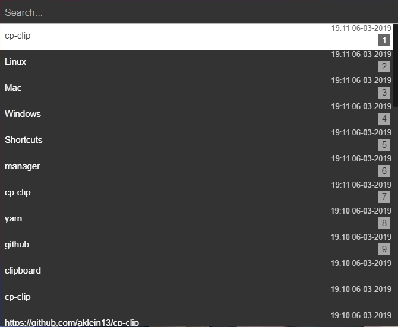

# cp-clip
A simple Electron clipboard manager.



Based on [electron-react-boilerplate](https://github.com/chentsulin/electron-react-boilerplate)

# Shortcuts
###### Type to search

- `Control/Command` + `Shift` + `V` = Open clipboard history window
- `Escape` = Close history window
- `Enter` = Paste selected entry from history
- `Arrow Up/Down` = Move 1 entry backwards/forwards
- `Shift` + `Arrow Up/Down` = Move 10 entries backwards/forwards
- `Control/Command` + `Backspace` = Clear search
- `Alt` + `Backspace` = Clear last word in search
- `Shift` + `Enter` = Search for Enter press (new lines)

## Instructions
##### [Download](https://github.com/aklein13/cp-clip/releases/latest) latest release for your platform
### Windows
1. Download <i>cp-clip-setup-x.x.x.exe</i>
2. Install it
### Mac
1. Download <i>cp-clip-x.x.x.dmg</i>
2. Run and drag it to your Applications
### Linux
1. Download <i>cp-clip-x.x.x-x86_64.AppImage</i>
2. Right click on it
3. Go to Properties and then Permissions
4. Check <i>Allow executing file as program</i>

Or you can just `chmod +x` it.

## Dev Instruction:
##### After downloading repository run [Yarn](https://yarnpkg.com/)
```bash
$ yarn
```
##### Then you can use one of the following commands:
- Run in dev environment
```bash
npm run dev
```
- Package release for your current platform
```bash
npm run package
```
- Package release for Windows, Mac and Linux
```bash
npm run package-all
```

# TODO
- Click out to close?
- Some styling
- Periodical/manual check for updates (right not it's on app start)
- `No updates found` message
