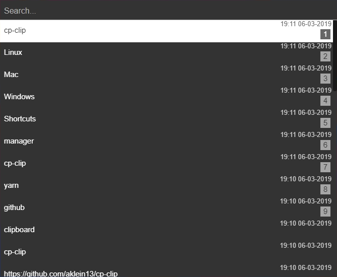

# cp-clip
A simple Electron clipboard manager.



Based on [electron-react-boilerplate](https://github.com/chentsulin/electron-react-boilerplate)

# Shortcuts
###### Type to search

- `Control/Command` + `Shift` + `V` = Open/close clipboard history window
- `Escape` = Close history window
- `Enter` = Paste selected entry from history
- `Arrow Up/Down` = Move 1 entry backwards/forwards
- `Control/Command` + [`1` - `9`] = Paste 1st - 9th element from history
- `Delete` or (`Control/Command` + `Shift` + `Backspace`) = Remove currently selected entry from history
- `Shift` + `Arrow Up/Down` = Move 10 entries backwards/forwards
- `Control/Command` + `Backspace` = Clear search
- `Alt` + `Backspace` = Clear last word in search
- `Shift` + `Enter` = Search for Enter press (new lines)
- `Control/Command` + `G` = Search selected (or last in clipboard) text in Google in default browser. Works everywhere.

## Instructions
##### [Download](https://github.com/aklein13/cp-clip/releases/latest) latest release for your platform
### Windows
1. Download <i>cp-clip-setup-x.x.x.exe</i>
2. Install it
### Mac
1. Download <i>cp-clip-x.x.x.dmg</i>
2. Run and drag it to your Applications
#### Linux
##### The latest version does not work at the moment. The latest working version is 0.5.1.
1. Download https://github.com/aklein13/cp-clip/releases/download/v0.5.1/cp-clip-0.5.1.AppImage
2. Right click on it
3. Go to Properties and then Permissions
4. Check <i>Allow executing file as program</i>
5. Run it

Or you can just `chmod +x` it.

If after going though above steps and running the application nothing happens, 
you most likely need to install `libgtk2.0-0` package manually.
In order to do that open your terminal and run `sudo apt-get install libgtk2.0-0`

## Dev Instruction:
##### After downloading repository run [Yarn](https://yarnpkg.com/)
You need to install `node_modules` in both root directory and `./app` directory.
```bash
yarn
cd app && yarn && cd ..
```
##### Then you can use following commands:
- Run in dev environment (from root directory)
```bash
yarn dev
```
- Package release for your current platform
```bash
yarn package
```
- Package release for Windows, Mac and Linux
```bash
yarn package-all
```

# TODO
- Fix "Rest and update" on update. Currently it doesn't work so it will update on next run.
- Settings to change key binds
- Allow for direct input on click
- Show release notes in update prompt?
- Some styling
